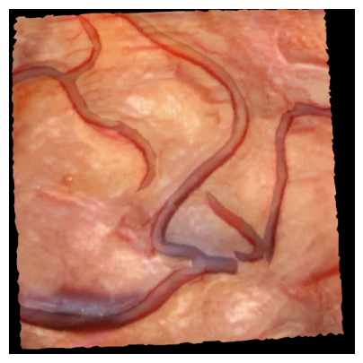
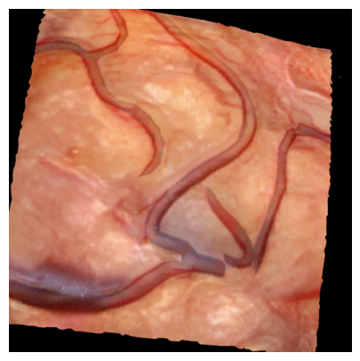

# 0. Imports and functions


```python
from pathlib import Path
from PIL import Image
import matplotlib.pyplot as plt

import math
import json

import torch
import torch.nn as nn
import torchvision.transforms as transforms
import numpy as np

from nerfstudio.cameras.cameras import Cameras, CameraType
from nerfstudio.scripts.eval import eval_setup
from nerfstudio.models.instant_ngp import NGPModel
```

    Jupyter environment detected. Enabling Open3D WebVisualizer.
    [Open3D INFO] WebRTC GUI backend enabled.
    [Open3D INFO] WebRTCWindowSystem: HTTP handshake server disabled.


```python
def image_to_tensor(image_path, device) -> torch.Tensor:
    # Open the image using PIL
    image = Image.open(image_path).convert("RGB")

    # Define the transform to convert the image to a PyTorch tensor
    transform = transforms.ToTensor()  # This will convert to a tensor with shape (C, H, W)

    # Apply the transform
    tensor = transform(image)  # Shape will be (3, 512, 512)

    # Permute the tensor to get shape (512, 512, 3)
    tensor = tensor.permute(1, 2, 0).to(device)

    return tensor.detach().requires_grad_(False)

def show_image(tensor):
    plt.figure(figsize=(5, 5))
    plt.imshow(np.array(tensor))
    plt.axis('off')
    plt.show()
```


```python
!ls
```

    cameras  main.py  nerf_inversion  outputs  README.md
    data	 misc	  notebooks	  paper


# 1. Setup


```python
# Loading the pre-trained NeRF model 
config_path = Path(
    "/n/home10/dpodolskyi/neural-registration/outputs/0_065_cat5_2/instant-ngp/2024-08-20_140044/config.yml")
_, pipeline, _, _ = eval_setup(config_path=config_path, test_mode="inference")
nerf_model = pipeline.model
assert isinstance(nerf_model, NGPModel), "pipeline.model is not of type NGPModel"
nerf_device = nerf_model.device
nerf_device
```


<pre style="white-space:pre;overflow-x:auto;line-height:normal;font-family:Menlo,'DejaVu Sans Mono',consolas,'Courier New',monospace">Loading latest checkpoint from load_dir
</pre>


<pre style="white-space:pre;overflow-x:auto;line-height:normal;font-family:Menlo,'DejaVu Sans Mono',consolas,'Courier New',monospace">✅ Done loading checkpoint from outputs/0_065_cat5_2/instant-ngp/<span style="color: #008080; text-decoration-color: #008080; font-weight: bold">2024</span>-<span style="color: #008080; text-decoration-color: #008080; font-weight: bold">08</span>-20_140044/nerfstudio_models/step-<span style="color: #008080; text-decoration-color: #008080; font-weight: bold">000018000.</span>ckpt
</pre>


    device(type='cuda', index=0)


```python
# This is a bit convoluted step, but it's the only way I found to get the camera parameters
# TODO: Find a better way to do this
dataparser_transforms_path = Path(
    "/n/home10/dpodolskyi/neural-registration/outputs/0_065_cat5_2/instant-ngp/2024-08-20_140044/dataparser_transforms.json")

with open(dataparser_transforms_path, "r") as f:
    dataparser_transform = json.load(f)

dataparser_matrix = torch.tensor(dataparser_transform["transform"], dtype=torch.float32)
dataparser_matrix = np.vstack((dataparser_matrix, np.array([[0, 0, 0, 1]])))
dataparser_scale = dataparser_transform["scale"]
```


```python
# Hardcided initial transformation matrix
# TODO: Find a way to automatically generate a starting point instead of relying on a hardcoded one
data_transform_matrix = np.array([
    [-0.16551750084030392, 0.17173068552312126, -0.9711398089695112, -80.73672706466026],
    [-0.9756847655052445, 0.11494663876681419, 0.18661861803471735, 15.51473463480075],
    [0.14367740002017088, 0.9784149640546033, 0.14852933325600515, 12.348141976499424],
    [0, 0, 0, 1],
])

camera_params = {
    "camera_angle_x": 0.5235987755982988,
    "camera_angle_y": 0.5235987755982988,
    "fl_x": 955.4050067376327,
    "fl_y": 955.4050067376327,
    "k1": 0,
    "k2": 0,
    "k3": 0,
    "k4": 0,
    "p1": 0,
    "p2": 0,
    "is_fisheye": False,
    "cx": 256.0,
    "cy": 256.0,
    "w": 512,
    "h": 512,
    "aabb_scale": 32,
}
```


```python

```


```python
# The camera object expects an input matrix to be transformed to the camera coordinate system
final_matrix = np.dot(dataparser_matrix, data_transform_matrix)
final_matrix[:3, 3] = final_matrix[:3, 3] * dataparser_scale

final_matrix_sliced = torch.tensor(final_matrix, dtype=torch.float32)[:3, :4]
final_matrix_param = nn.Parameter(final_matrix_sliced, requires_grad=True)

final_matrix_param, final_matrix_param.shape

# should look like this:
# actual_transform_matrix = np.array([
#     [-0.2205035537481308, -0.21815498173236847, -0.9506769180297852, -0.11759857088327408],
#     [-0.9667345285415649, 0.17840947210788727, 0.1832878142595291, 0.23202396929264069],
#     [0.129624605178833, 0.9594677686691284, -0.2502378523349762, -0.26915040612220764],
#     [0, 0, 0, 1]
# ])
```


    (Parameter containing:
     tensor([[-0.2205, -0.2182, -0.9507, -0.1176],
             [-0.9667,  0.1784,  0.1833,  0.2320],
             [ 0.1296,  0.9595, -0.2502, -0.2692]], requires_grad=True),
     torch.Size([3, 4]))


```python
# Creating a camera object to render images

camera = Cameras(
    camera_to_worlds=final_matrix_param.unsqueeze(0), # 1x3x4 tensor
    fx=camera_params["fl_x"],
    fy=camera_params["fl_y"],
    cx=camera_params["cx"],
    cy=camera_params["cy"],
    camera_type=CameraType.PERSPECTIVE,
    height=camera_params["h"],
    width=camera_params["w"],
)
```


```python
nerf_model.train(True)

for param in nerf_model.parameters():
    param.requires_grad = False
    
nerf_model.zero_grad()
```


```python
outputs = nerf_model.get_outputs_for_camera(camera)
generated_rgb = outputs["rgb"]
generated_rgb.device
```


    device(type='cpu')


```python
plt.figure(figsize=(5, 5))
plt.imshow(np.array(generated_rgb))
plt.axis('off')
plt.show()
```


    

    


```python

```


```python

```

# 2. Training


```python
# Step 1: Get the target image
target_image = image_to_tensor("/n/home10/dpodolskyi/neural-registration/data/datasets/0_065_cat5_2.0/images/4.png", device=nerf_model.device)
show_image(target_image.cpu())
target_image.shape, target_image.requires_grad, target_image.device
```


    

    


    (torch.Size([512, 512, 3]), False, device(type='cuda', index=0))


```python
final_matrix_param
```


    Parameter containing:
    tensor([[-0.2205, -0.2182, -0.9507, -0.1176],
            [-0.9667,  0.1784,  0.1833,  0.2320],
            [ 0.1296,  0.9595, -0.2502, -0.2692]], requires_grad=True)


```python
# Step 2: Get the starting image
camera = pipeline.datamanager.train_dataset.cameras[0].to(nerf_device)
camera.camera_to_worlds = torch.tensor(final_matrix_param, dtype=torch.float32, device=nerf_device)

rendered_image = nerf_model.get_outputs_for_camera(camera)["rgb"]
rendered_image.requires_grad = True
show_image(rendered_image.cpu().detach().numpy())
rendered_image.shape, rendered_image.requires_grad, rendered_image.device
```

    /tmp/ipykernel_3278246/424804541.py:3: UserWarning: To copy construct from a tensor, it is recommended to use sourceTensor.clone().detach() or sourceTensor.clone().detach().requires_grad_(True), rather than torch.tensor(sourceTensor).
      camera.camera_to_worlds = torch.tensor(final_matrix_param, dtype=torch.float32, device=nerf_device)


    

    


    (torch.Size([512, 512, 3]), True, device(type='cuda', index=0))


```python
print("rendered image details: ", rendered_image.shape, rendered_image.requires_grad, rendered_image.device)
print("target image details: ", target_image.shape, target_image.requires_grad, target_image.device)
```

    rendered image details:  torch.Size([512, 512, 3]) True cuda:0
    target image details:  torch.Size([512, 512, 3]) False cuda:0


```python
loss_fn = nn.MSELoss()
optimizer = torch.optim.AdamW([final_matrix_param])

loss = loss_fn(rendered_image, target_image)
```


```python
camera = pipeline.datamanager.train_dataset.cameras[0].to(nerf_device)
camera.camera_to_worlds = final_matrix_param
nerf_model = nerf_model.train()
target_image = image_to_tensor("/n/home10/dpodolskyi/neural-registration/data/datasets/0_065_cat5_2.0/images/4.png", device=nerf_model.device)

for i in range(10):
    # Create camera with final_matrix_param every iteration to maintain gradient connection
    camera = Cameras(
        camera_to_worlds=final_matrix_param.unsqueeze(0),  # Keep batch dimension
        fx=camera_params["fl_x"],
        fy=camera_params["fl_y"],
        cx=camera_params["cx"],
        cy=camera_params["cy"],
        camera_type=CameraType.PERSPECTIVE,
        height=camera_params["h"],
        width=camera_params["w"],
    ).to(nerf_device)
    
    # Get rendered image
    outputs = nerf_model.get_outputs_for_camera(camera)
    rendered_image = outputs["rgb"].to(nerf_device)
    
    # Calculate loss
    loss = loss_fn(rendered_image, target_image)
    
    # Backprop
    optimizer.zero_grad()
    loss.backward()
    optimizer.step()
    
    print(f"Iteration {i}: Loss = {loss.item()}")
    
    # Optionally visualize progress every few iterations
    if i % 5 == 0:
        show_image(rendered_image.cpu().detach().numpy())
```


    ---------------------------------------------------------------------------

    RuntimeError                              Traceback (most recent call last)

    Cell In[20], line 28
         26 # Backprop
         27 optimizer.zero_grad()
    ---> 28 loss.backward()
         29 optimizer.step()
         31 print(f"Iteration {i}: Loss = {loss.item()}")


    File ~/.conda/envs/nerf-inversion/lib/python3.8/site-packages/torch/_tensor.py:492, in Tensor.backward(self, gradient, retain_graph, create_graph, inputs)
        482 if has_torch_function_unary(self):
        483     return handle_torch_function(
        484         Tensor.backward,
        485         (self,),
       (...)
        490         inputs=inputs,
        491     )
    --> 492 torch.autograd.backward(
        493     self, gradient, retain_graph, create_graph, inputs=inputs
        494 )


    File ~/.conda/envs/nerf-inversion/lib/python3.8/site-packages/torch/autograd/__init__.py:251, in backward(tensors, grad_tensors, retain_graph, create_graph, grad_variables, inputs)
        246     retain_graph = create_graph
        248 # The reason we repeat the same comment below is that
        249 # some Python versions print out the first line of a multi-line function
        250 # calls in the traceback and some print out the last line
    --> 251 Variable._execution_engine.run_backward(  # Calls into the C++ engine to run the backward pass
        252     tensors,
        253     grad_tensors_,
        254     retain_graph,
        255     create_graph,
        256     inputs,
        257     allow_unreachable=True,
        258     accumulate_grad=True,
        259 )


    RuntimeError: element 0 of tensors does not require grad and does not have a grad_fn


```python

```
